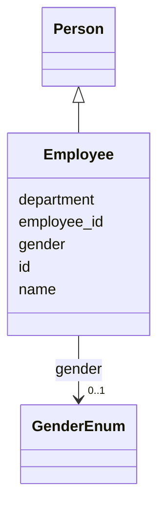

# Class: Employee 


_A person employed by an organization._


URI: [ex:Employee](https://example.org/Employee)





## Inheritance
* [Person](Person.md)
    * **Employee**


## Slots

| Name | Cardinality and Range | Description | Inheritance |
| ---  | --- | --- | --- |
| [employee_id](employee_id.md) | 0..1 <br/> [String](String.md) |  | direct |
| [department](department.md) | 0..1 <br/> [String](String.md) |  | direct |
| [id](id.md) | 1 <br/> [String](String.md) |  | [Person](Person.md) |
| [name](name.md) | 1 <br/> [String](String.md) |  | [Person](Person.md) |
| [gender](gender.md) | 0..1 <br/> [GenderEnum](GenderEnum.md) |  | [Person](Person.md) |


## Identifier and Mapping Information


### Schema Source


* from schema: https://example.org/derived_schema


## Mappings

| Mapping Type | Mapped Value |
| ---  | ---  |
| self | ex:Employee |
| native | ex:Employee |


## LinkML Source

<!-- TODO: investigate https://stackoverflow.com/questions/37606292/how-to-create-tabbed-code-blocks-in-mkdocs-or-sphinx -->

### Direct

<details>
```yaml
name: Employee
description: A person employed by an organization.
from_schema: https://example.org/derived_schema
is_a: Person
attributes:
  employee_id:
    name: employee_id
    from_schema: https://example.org/derived_schema
    rank: 1000
    domain_of:
    - Employee
    range: string
  department:
    name: department
    from_schema: https://example.org/derived_schema
    rank: 1000
    domain_of:
    - Employee
    range: string

```
</details>

### Induced

<details>
```yaml
name: Employee
description: A person employed by an organization.
from_schema: https://example.org/derived_schema
is_a: Person
attributes:
  employee_id:
    name: employee_id
    from_schema: https://example.org/derived_schema
    rank: 1000
    alias: employee_id
    owner: Employee
    domain_of:
    - Employee
    range: string
  department:
    name: department
    from_schema: https://example.org/derived_schema
    rank: 1000
    alias: department
    owner: Employee
    domain_of:
    - Employee
    range: string
  id:
    name: id
    from_schema: https://example.org/base_schema
    rank: 1000
    identifier: true
    alias: id
    owner: Employee
    domain_of:
    - Person
    range: string
  name:
    name: name
    from_schema: https://example.org/base_schema
    rank: 1000
    alias: name
    owner: Employee
    domain_of:
    - Person
    range: string
    required: true
  gender:
    name: gender
    from_schema: https://example.org/base_schema
    rank: 1000
    alias: gender
    owner: Employee
    domain_of:
    - Person
    range: GenderEnum

```
</details>