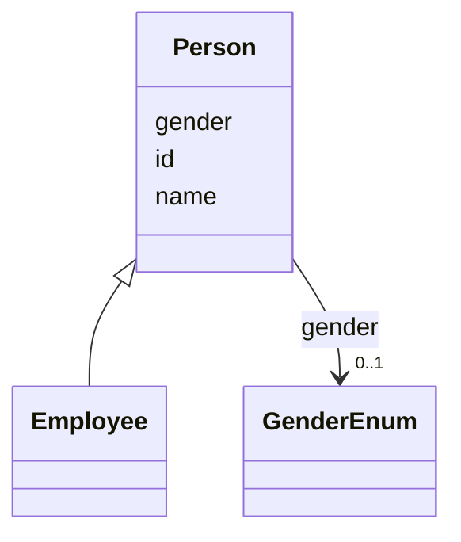

# Class: Person 


_A human being._


URI: [ex:Person](https://example.org/Person)





## Inheritance
* **Person**
    * [Employee](Employee.md)


## Slots

| Name | Cardinality and Range | Description | Inheritance |
| ---  | --- | --- | --- |
| [id](id.md) | 1 <br/> [String](String.md) |  | direct |
| [name](name.md) | 1 <br/> [String](String.md) |  | direct |
| [gender](gender.md) | 0..1 <br/> [GenderEnum](GenderEnum.md) |  | direct |


## Identifier and Mapping Information


### Schema Source


* from schema: https://example.org/derived_schema


## Mappings

| Mapping Type | Mapped Value |
| ---  | ---  |
| self | ex:Person |
| native | ex:Person |


## LinkML Source

<!-- TODO: investigate https://stackoverflow.com/questions/37606292/how-to-create-tabbed-code-blocks-in-mkdocs-or-sphinx -->

### Direct

<details>
```yaml
name: Person
description: A human being.
from_schema: https://example.org/derived_schema
attributes:
  id:
    name: id
    from_schema: https://example.org/base_schema
    rank: 1000
    identifier: true
    domain_of:
    - Person
    range: string
    required: true
  name:
    name: name
    from_schema: https://example.org/base_schema
    rank: 1000
    domain_of:
    - Person
    required: true
  gender:
    name: gender
    from_schema: https://example.org/base_schema
    rank: 1000
    domain_of:
    - Person
    range: GenderEnum

```
</details>

### Induced

<details>
```yaml
name: Person
description: A human being.
from_schema: https://example.org/derived_schema
attributes:
  id:
    name: id
    from_schema: https://example.org/base_schema
    rank: 1000
    identifier: true
    alias: id
    owner: Person
    domain_of:
    - Person
    range: string
    required: true
  name:
    name: name
    from_schema: https://example.org/base_schema
    rank: 1000
    alias: name
    owner: Person
    domain_of:
    - Person
    range: string
    required: true
  gender:
    name: gender
    from_schema: https://example.org/base_schema
    rank: 1000
    alias: gender
    owner: Person
    domain_of:
    - Person
    range: GenderEnum

```
</details>